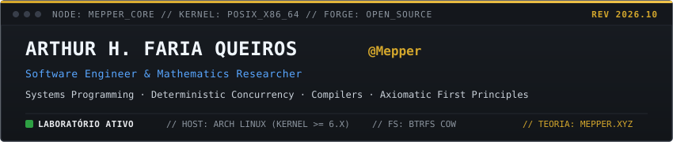
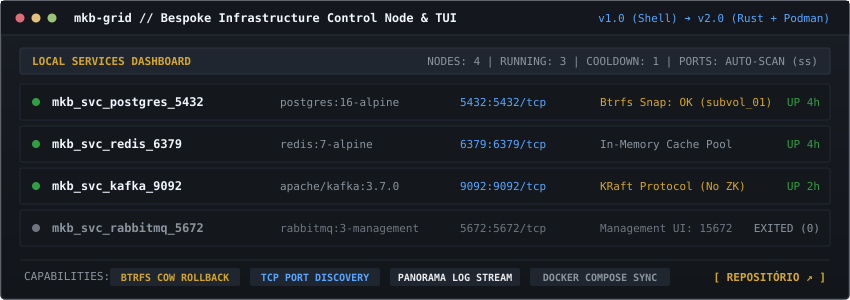
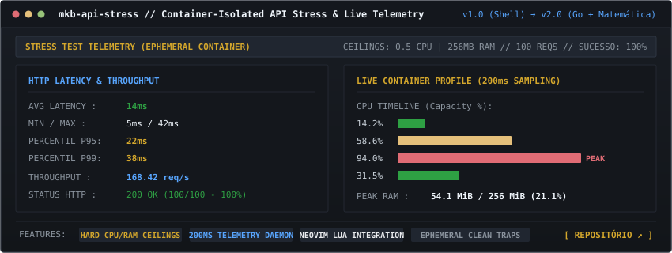
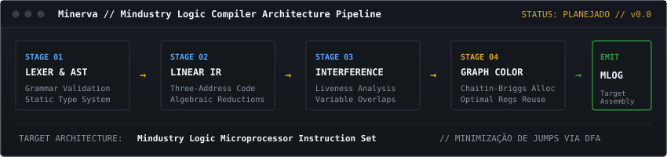

# Arthur H. Faria Queiros (@Mepper)

<p align="center">
  
</p>

<div align="center">
  
  <br/><br/>
  <b>Arthur H. Faria Queiros</b> &nbsp;|&nbsp; <code>@Mepper</code><br/>
  <i>Engenheiro de Software &amp; Pesquisador de Matemática</i>
  <br/><br/>
  <code>OPEN-SOURCE FORGE</code> &nbsp;·&nbsp; <code>POSIX / ARCH LINUX</code> &nbsp;·&nbsp; <code>REV 2026.10</code>
  <br/><br/>
  <a href="https://mepper.xyz"><code>[ Acervo Teórico (mepper.xyz) ↗ ]</code></a> &nbsp;
  <a href="https://x.com/my_name_is_arth"><code>[ X (@my_name_is_arth) ↗ ]</code></a> &nbsp;
  <a href="https://github.com/arthur-hfq?tab=repositories"><code>[ Repositórios Públicos ↗ ]</code></a>
</div>

---

### § 00 // O Laboratório Open-Source & Propósito Deste Espaço

Este perfil no GitHub funciona como uma forja pública e laboratório de engenharia. É o espaço onde transformo investigação teórica e primeiros princípios em software executável, ferramentas de infraestrutura local, utilitários de terminal e compiladores.

O ecossistema divide-se em duas esferas complementares:

- **[mepper.xyz](https://mepper.xyz) (Acervo Teórico)**: O arquivo formal onde publico compêndios, deduções matemáticas em lâminas B5, fundamentos de álgebra linear, cálculo e propedêutica epistemológica.
- **GitHub @arthur-hfq (Engenharia de Sistemas)**: O ambiente de implementação aberta. Aqui o foco reside na robustez do código-fonte, performance determinística, arquitetura de sistemas operacionais e ausência de camadas desnecessárias de abstração.

Todo software publicado neste espaço é de código aberto, concebido sob o princípio da transparência e utilidade real: sem muros de assinatura, sem coleta invasiva de telemetria e sem dependências ocultas.

---

### § 01 // Projetos em Desenvolvimento Ativo

#### 01. mkb-grid
*Bespoke Terminal UI & Infrastructure Control Node for Local Containers*

<p align="center">
  <a href="https://github.com/arthur-hfq/mkb-grid">
    
  </a>
</p>

- **Domínio**: Infraestrutura Local, Orquestração &amp; TUI
- **Estado**: `v1.0 (Shell POC funcional) -> v2.0 (Reescrita em Rust + Podman + Quickshell)`
- **Repositório**: [`arthur-hfq/mkb-grid`](https://github.com/arthur-hfq/mkb-grid)
- **Motivação &amp; Arquitetura**:
  - Elimina comandos extensos de `docker run` e interfaces web pesadas através de um painel brutalista de terminal orientado a teclado (atalhos Vim).
  - **Snapshots Atômicos Btrfs CoW**: Utiliza subvolumes Copy-on-Write do Btrfs para persistência de dados dos bancos (PostgreSQL, Redis, Kafka KRaft), permitindo gerar snapshots instantâneos e realizar rollbacks sem necessidade de recriar contêineres.
  - **Descoberta de Portas Livres**: Varre sockets TCP do host via `ss` e mapeamentos de runtime para alocar portas livres automaticamente, eliminando colisões de rede no desenvolvimento local.
  - **Topologia &amp; Panorama**: Criação e isolamento de redes em bridge com agregação contínua de logs de todos os nós conectados.

---

#### 02. mkb-api-stress
*Docker-Isolated API Stress & Load Testing Engine with Live Container Telemetry*

<p align="center">
  <a href="https://github.com/arthur-hfq/mkb-api-stress">
    
  </a>
</p>

- **Domínio**: Sistemas de Alta Performance, Telemetria &amp; Concorrência
- **Estado**: `v1.0 (Shell POC funcional) -> v2.0 (Reescrita em Go + Modelagem Estocástica)`
- **Repositório**: [`arthur-hfq/mkb-api-stress`](https://github.com/arthur-hfq/mkb-api-stress)
- **Motivação &amp; Arquitetura**:
  - Testes de carga tradicionais executados no host mascaram vazamentos de memória e gargalos de CPU que surgem apenas em contêineres de produção com cotas estritas (ECS, Kubernetes).
  - Executa backends sob **tetos físicos rígidos** (`--cpus`, `--memory`) em contêineres efêmeros descartáveis com limpeza automática via process traps.
  - **Daemon de Telemetria (200ms)**: Amostra saturação em tempo real, gerando relatórios de percentis de latência (P50, P95, P99) e linha do tempo normalizada da capacidade da CPU.
  - **Integração Neovim via Lua**: Comunicação bidirecional direta com buffers do Neovim para disparar benchmarks e visualizar relatórios dentro do fluxo de desenvolvimento.

---

#### 03. Minerva
*Mindustry Logic High-Level Compiler*

<p align="center">
  
</p>

- **Domínio**: Compiladores, Teoria de Grafos &amp; Autômatos Finitos
- **Estado**: `Planejado // Versão 0.0 (Design de Arquitetura &amp; Especificação Formal)`
- **Motivação &amp; Arquitetura**:
  - Compilador de linguagem estruturada de alto nível direcionado ao conjunto de instruções dos microprocessadores lógicos do Mindustry (Mlog).
  - **Pipeline em 5 Estágios**:
    1. *Análise Léxica &amp; Sintática*: Geração de AST com checagem estática de tipos.
    2. *Representação Intermediária (IR)*: Código de três endereços linearizado com simplificação algébrica de expressões.
    3. *Grafo de Interferência*: Análise formal de tempo de vida de variáveis (*liveness analysis*).
    4. *Coloração de Grafos (Chaitin-Briggs)*: Alocação ótima dos 64 registradores disponíveis no hardware virtual do jogo.
    5. *Emissão MLOG &amp; DFA*: Minimização determinística de saltos condicionais via autômatos finitos.

---

### § 02 // Matriz Operacional & Ferramentas

| Camada | Tecnologias &amp; Padrões | Propósito Principal |
| :--- | :--- | :--- |
| **Sistemas &amp; Baixo Nível** | C, Rust, Go, POSIX Shell | Engenharia de ferramentas CLI, controle de processos e concorrência |
| **Sistemas de Arquivos** | Btrfs (Subvolumes CoW, Snapshots) | Persistência atômica e rollbacks instantâneos de estado |
| **Runtimes de Contêiner** | Podman, Docker Engine, OCI | Isolamento de recursos sob tetos estritos de hardware |
| **Pesquisa &amp; Prototipagem** | Python, Lua, Typst, LaTeX | Computação científica, autômatos, documentação técnica formal |
| **Ambiente de Desenvolvimento**| Arch Linux (Kernel &gt;= 6.x), Neovim, Tmux, GNU Make | Fluxo de edição modal orientado a teclado e automação determinística |

---

### § 03 // Conexões & Registros

- **Acervo Teórico & Compêndios Formais**: [mepper.xyz](https://mepper.xyz)
- **Notas Técnicas & Dispatches (X)**: [@my_name_is_arth](https://x.com/my_name_is_arth)
- **Repositórios de Código**: [github.com/arthur-hfq](https://github.com/arthur-hfq?tab=repositories)

```text
+------------------------------------------------------------------------------+
|  MEPPER // ACERVO DE ENGENHARIA DE SISTEMAS // OPEN SOURCE // REV 2026.10    |
+------------------------------------------------------------------------------+
```
